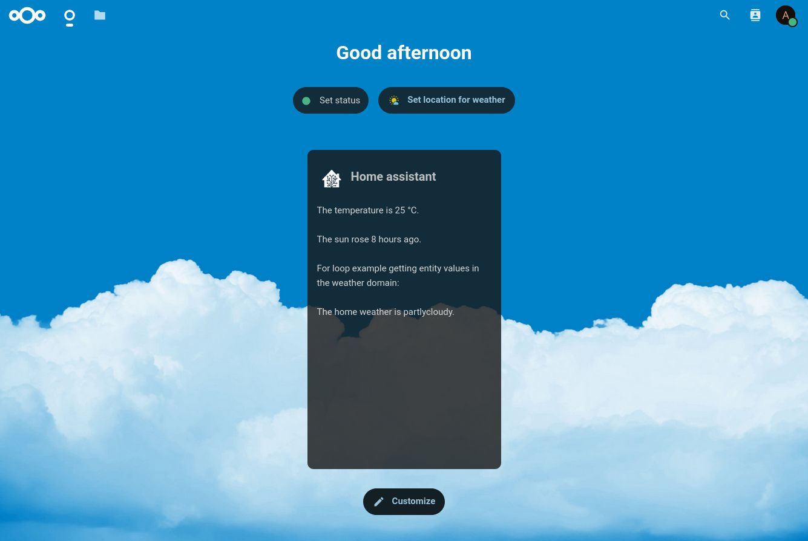

<!--
SPDX-FileCopyrightText: Poulou <poulou.0@gmail.com>
SPDX-License-Identifier: CC0-1.0
-->



# Home Assistant Integration
Place this app in **nextcloud/apps/**

## Development environment

### Nextcloud dev
> https://github.com/juliushaertl/nextcloud-docker-dev#simple-master-setup
```shell
cd ~/Projects
git clone https://github.com/juliushaertl/nextcloud-docker-dev
cd nextcloud-docker-dev
./bootstrap.sh
docker-compose up nextcloud
```
go to `http://nextcloud.local` (`admin:admin` for credentials)
### App dev

```shell
sudo apt install php php-xml php-curl composer
```
```shell
cd ~/Projects/nextcloud-docker-dev
git clone git@github.com:poulou0/nextcloud-homeassistant-integration.git workspace/server/apps-extra/integration_homeassistant/
cd workspace/server/apps-extra/integration_homeassistant/
npm install
make
```

## Publish to App Store

First get an account for the [App Store](http://apps.nextcloud.com/) then run:

    make && make appstore

The archive is located in build/artifacts/appstore and can then be uploaded to the App Store.

Post it here according to the instructions: https://apps.nextcloud.com/developer/apps/releases/new

```shell
openssl dgst -sha512 -sign ~/.nextcloud/certificates/integration_homeassistant.key ~/Projects/nextcloud-docker-dev/workspace/server/apps-extra/integration_homeassistant/build/artifacts/appstore/integration_homeassistant.tar.gz | openssl base64
```

## Building the app

The app can be built by using the provided Makefile by running:

    make

This requires the following things to be present:
* make
* which
* tar: for building the archive
* curl: used if phpunit and composer are not installed to fetch them from the web
* npm: for building and testing everything JS, only required if a package.json is placed inside the **js/** folder

The make command will install or update Composer dependencies if a composer.json is present and also **npm run build** if a package.json is present in the **js/** folder. The npm **build** script should use local paths for build systems and package managers, so people that simply want to build the app won't need to install npm libraries globally, e.g.:

**package.json**:
```json
"scripts": {
    "test": "node node_modules/gulp-cli/bin/gulp.js karma",
    "prebuild": "npm install && node_modules/bower/bin/bower install && node_modules/bower/bin/bower update",
    "build": "node node_modules/gulp-cli/bin/gulp.js"
}
```

## Running tests
You can use the provided Makefile to run all tests by using:

    make test

This will run the PHP unit and integration tests and if a package.json is present in the **js/** folder will execute **npm run test**

Of course you can also install [PHPUnit](http://phpunit.de/getting-started.html) and use the configurations directly:

    phpunit -c phpunit.xml

or:

    phpunit -c phpunit.integration.xml

for integration tests
